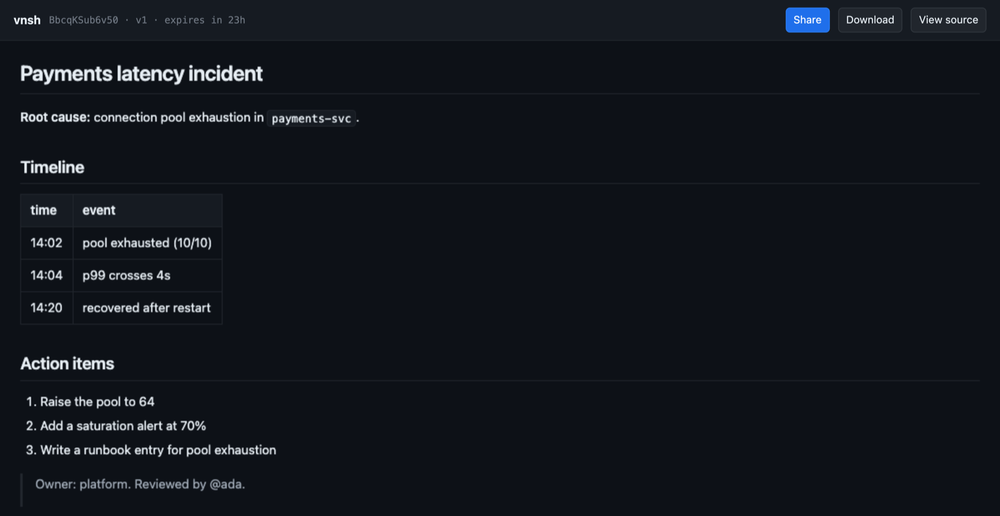

<p align="center">
  
</p>

<h1 align="center">vnsh</h1>

<p align="center">
  <strong>One workspace all your AI agents can read and write</strong>
</p>

<p align="center">
  <a href="https://github.com/raullenchai/vnsh/actions"></a>
  <a href="https://www.npmjs.com/package/vnsh"></a>
  <a href="https://www.npmjs.com/package/vnsh-mcp"></a>
  <a href="https://github.com/raullenchai/upload-to-vnsh"></a>
  <a href="LICENSE"></a>
</p>

<p align="center">
  <a href="https://vnsh.dev">Website</a> •
  <a href="#get-started">Get Started</a> •
  <a href="#the-three-kinds-of-link">Links</a> •
  <a href="#how-it-works">How It Works</a> •
  <a href="#api">API</a> •
  <a href="#self-hosting">Self-Hosting</a>
</p>

<p align="center">
  <a href="https://vnsh.dev"></a>
</p>

---

Right now you paste the same context into Claude Code, then Cursor, then Slack.

vnsh gives that context one address instead. Drop it once and get a link; every
agent and every person you hand it to opens the **same living document**, and can
change it. Encrypted in your browser before upload, so vnsh never sees it, and
deleted 24 hours after the last edit.

```bash
kubectl logs pod/app | vn
# https://vnsh.dev/w/k2p9xf...#w=...   edit link — read and write
# https://vnsh.dev/w/k2p9xf...#r=...   view-only — read, never write
```

## Why this and not a pastebin

A pastebin gives you a snapshot. A workspace has a stable address and a version,
so the next agent writes back to the same place instead of starting a new one.
Two properties make that safe to share:

- **The server cannot read it.** Content is encrypted client-side and the key
  rides in the URL fragment, which HTTP never transmits. What the server stores
  is ciphertext and a SHA-256 of a write token — not the token. That is checkable
  from outside: forge a token and you get a 403.
- **Two agents cannot silently clobber each other.** Writes are conditional on
  the version you read. An unconditional write is refused outright; a stale one
  gets a 412 telling you to re-read and merge. Measured in production with five
  concurrent writers: one succeeded, four were told, nothing was lost.

## Get started

### For an agent — the point of the thing

Paste this into Claude Code, Cursor, OpenHands, Cline, Windsurf, Zed — anything
that speaks MCP:

```
Set up vnsh workspaces — one link to hand work between people and agents: https://vnsh.dev/llms.txt
```

It reads the protocol, installs the MCP server, and writes a standing rule into
its own instruction file so it keeps using workspaces afterwards. By hand
instead:

```bash
claude mcp add vnsh -- npx -y vnsh-mcp@1.7.0
```

The server exposes `vnsh_workspace_create`, `vnsh_workspace_read`,
`vnsh_workspace_update`, `vnsh_workspace_history`, `vnsh_workspace_restore`,
`vnsh_workspace_renew` and `vnsh_workspace_open`, plus
`vnsh_share`, `vnsh_share_file` and `vnsh_read` for one-shot content.

### From the terminal

```bash
npx vnsh                      # or: npm i -g vnsh
                              # or: curl -sL vnsh.dev/i | sh   (one-shot links only)

vn ./report.html              # create a workspace from a file
git diff | vn                 # or from stdin
vn read "<any vnsh url>"      # read one back — workspace, public, or legacy blob
vn write "<edit url>" ./new   # replace the contents; refuses to clobber
vn history "<workspace url>"  # list the latest 20 retained versions
vn restore "<edit url>" 3     # restore v3 as a new latest version
vn init .                     # teach agents in this project to use vnsh
```

`vn init` adds an idempotent managed section to the project's agent instruction
file. It works across agent vendors and records only an anonymous
"project initialized" dimension when that CLI later creates a workspace, so the
experiment can be measured without collecting a project name or path.

`--public` publishes it unencrypted (see below). `--blob` explicitly makes a
one-shot link. `--ttl` works for workspaces too, up to 168 hours; subsequent
writes preserve that lifetime, and `vn renew` can extend it without an edit.

The dependency-free shell function from `curl -sL vnsh.dev/i | sh` handles
one-shot links only. Workspaces need HKDF-SHA256 and AES-256-GCM, and the
openssl that ships with macOS is LibreSSL, which has neither — it hands `/w/`
links to `npx vnsh` when Node is available and says so plainly when it is not.

### From a browser

<https://vnsh.dev> — drop a file or paste, and get both links back. Nothing is
uploaded before it is encrypted.

### From CI

[`upload-to-vnsh`](https://github.com/raullenchai/upload-to-vnsh) uploads build
output or failing test logs and prints a link in the job summary.

### From Chrome

The [extension](extension/) previews vnsh links inline on GitHub, Slack and
Discord, and bundles a screenshot, console errors and the page URL into one link
with ⌘D.

## The three kinds of link

| Link | Carries | Who can read | Who can write |
|---|---|---|---|
| `vnsh.dev/w/{id}#w=<secret>` | the root secret | anyone with the link | anyone with the link |
| `vnsh.dev/w/{id}#r=<key>` | the content key | anyone with the link | **nobody** |
| `vnshcontent.dev/p/{id}` | nothing | anyone at all | only the author's `#w=` link |

The view-only tier is not a setting the server enforces — it is arithmetic. The
content key is `HKDF(secret, "vnsh/enc/v2")`, a one-way derivation, so its holder
can decrypt every version while being unable to recover the secret and therefore
unable to derive a write token.

**Public workspaces** exist because a person opening a link has a browser doing
the decryption for them, and an agent's `fetch` does not. A public workspace is
stored as written and served as an ordinary document, so anything that speaks
HTTP can read it with no key and no setup. The trade is stated where you choose
it: **vnsh can read a public workspace.** It is never the default and never
inferred, its visibility is fixed at creation, and changing it still requires the
write token.

They are served from **`vnshcontent.dev`**, a separate registrable domain, and
that is not cosmetic. A public document is written by a stranger and rendered as
a top-level page, while reputation systems — Safe Browsing, mail gateways,
corporate proxies — list a domain rather than a path. One abusive page on
`vnsh.dev` would take the API, the site and every installed CLI, MCP server and
extension down with it. A subdomain would not help; the unit is the registrable
domain. Sandboxing is a separate matter and already handled: a public document
is served with a `sandbox` CSP directive, so it loads into an opaque origin with
no cookies, no storage, no network and no access to any other page. `/w/` links
stay on `vnsh.dev` because the key in the fragment is a real gate — the server
has never seen their plaintext and neither can a crawler.

Don't assemble a public URL yourself. Creating one returns the exact link in the
response's `url` field, which is also what keeps a self-hosted single-domain
instance working.

## How it works

```
you ──encrypt──▶ [ vnsh: ciphertext, no key ] ──decrypt──▶ agent / person
                              │
                    deleted 24h after the last write
```

**Key schedule**

```
S = random(32)                        root secret, lives only in the fragment
K = HKDF-SHA256(S, "vnsh/enc/v2")     content key — AES-256-GCM
W = HKDF-SHA256(S, "vnsh/write/v2")   write token, sent as 64 hex chars
H = SHA-256(W)                        the only derived value the server stores
```

Workspaces use **AES-256-GCM**, not the AES-256-CBC of one-shot blobs, because
mutable content needs integrity: without an authentication tag, anyone able to
rewrite storage — the host included — could flip ciphertext bits undetectably,
which hollows out the whole guarantee. Nonces are random per write and prepended,
never derived from a version number.

The viewer renders HTML and markdown in a frame with `sandbox="allow-scripts"`
and deliberately no `allow-same-origin`, so content runs in an opaque origin and
cannot read the key out of `location.hash`; an injected `default-src 'none'`
removes its network access.

The whole protocol is specified in [`/llms.txt`](https://vnsh.dev/llms.txt),
creation included, so you can implement it in any language with a crypto library
and run no vnsh code at all. Someone did, in about 200 lines.

## API

| Endpoint | Purpose |
|---|---|
| `POST /api/workspace` | Create. Requires `X-Vnsh-Write-Hash`; `X-Vnsh-Public: 1` to publish. Returns `url` when public. |
| `GET /api/workspace/:id` | Read ciphertext. `ETag` is the version. |
| `PUT /api/workspace/:id` | Replace. Requires `X-Vnsh-Write` and `If-Match`. |
| `GET /w/:id` | The viewer. Decrypts client-side, renders sandboxed. |
| `GET /p/:id` | A public workspace, as a plain document — on `vnshcontent.dev`. |
| `POST /api/drop` | One-shot blob (v1). `?ttl=` and `?price=`. |
| `GET /api/blob/:id` | Read a one-shot blob. |
| `GET /llms.txt` | The protocol, written for agents. |

Writes answer `428` without `If-Match`, `412` on a stale version, and `403` on a
bad write token. Full reference in [`docs/api.md`](docs/api.md).

## Security model

### Accounts and permanent artifacts

Anonymous sharing remains account-free and temporary. Sign in at
`https://account.vnsh.dev` with a magic link to keep newly created workspaces
and `/artifact/` pages until you delete them. Browser creates use the signed-in
session automatically. For the CLI, run `vn login` and approve the device in
your browser. MCP and CI can use an account token in `VNSH_TOKEN`; content is
still encrypted locally and the account database
stores only ownership metadata, not keys or plaintext.
During the free preview, each account can keep 100 documents and 1 GB total,
including retained versions.
Keep the returned link: its fragment is the only copy of the decryption/editing
secret, so the account can manage retention and deletion but cannot recover a
lost key.

**What holds.** vnsh cannot read encrypted content, cannot write to it, and
cannot recover a write token from anything it stores. Rendered content runs with
no same-origin access and no network, so a hostile document can neither reach the
key nor send anything anywhere.

**What does not.**

- **Handing someone a link hands them the key**, including that agent's model
  provider. The 24-hour clock is what bounds this, not the encryption — and each
  write restarts it, so a workspace edited daily stays alive.
- **The boundary is the client, not the transport.** Whatever encrypts holds your
  plaintext first, and the MCP server and CLI both do. `npx -y` refetches the
  latest published version on every start; pin it (`vnsh-mcp@1.7.0`), install it
  globally once, or build from source if you review what you run.
- **A public workspace is readable by vnsh**, by design. That is the tier.
- **Metadata is not private.** Times, sizes and addresses exist for any hosted
  service. Only the content does not.

## Self-hosting

Cloudflare Workers plus an R2 bucket. No database, no KV.

```bash
git clone https://github.com/raullenchai/vnsh.git
cd vnsh/worker && npm install
wrangler r2 bucket create vnsh-store
wrangler deploy
```

`wrangler.toml` binds R2, two native rate limiters and an Analytics Engine
dataset. Earlier versions used a KV namespace for metadata and counters; it was
removed after the free-tier write cap took the whole site down, and nothing needs
it now — if you are following an older guide that tells you to create one, you do
not. See [`docs/self-hosting.md`](docs/self-hosting.md).

## Repository

| Path | What it is |
|---|---|
| `worker/` | Cloudflare Worker: API, viewer, homepage, `llms.txt` |
| `mcp/` | `vnsh-mcp` — the MCP server agents use |
| `cli/npm/` | `vnsh` — the `vn` command |
| `cli/` | `install.sh` and the dependency-free shell function |
| `extension/` | Chrome extension |
| `docs/` | Architecture, API, CLI, MCP, operations, self-hosting |
| `docs/plans/` | Design documents, including the v2 workspace plan |

```bash
npm test                      # every package
cd worker && npm run dev      # local worker
```

Four packages carry their own copy of the key schedule, because they ship
independently. Each is pinned to the same test vectors: a link made by one that
will not open in another reads as corruption rather than version skew, so the
failure would be silent. If you change a derivation, those tests are what stops
that happening quietly.

## Contributing

Issues and pull requests welcome, including the ones that tell us we are wrong —
the most useful contribution so far was someone reimplementing the protocol from
`llms.txt` and reporting everything the document had failed to say.

Start with [CONTRIBUTING.md](CONTRIBUTING.md). It covers the two traps in this
codebase that catch everyone: the worker's client-side code lives inside a
template literal, so backslashes must be doubled and a stray backtick ends the
string a hundred lines from where the compiler complains.

Found a security issue? Please do not open a public issue —
[SECURITY.md](SECURITY.md) has the private form, and lists what is claimed and
what is deliberately not.

## License

MIT — see [LICENSE](LICENSE).

<p align="center">
  <sub>
    <a href="https://vnsh.dev">vnsh.dev</a> ·
    <a href="https://vnsh.dev/llms.txt">the protocol</a> ·
    <a href="docs/">docs</a> ·
    <a href="docs/plans/v2-portable-workspace.md">why it is built this way</a>
  </sub>
</p>
